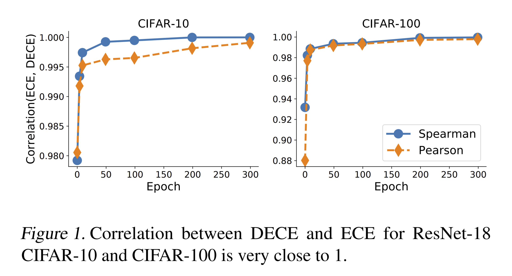

# Meta-Calibration: Learning of Model Calibration Using Differentiable Expected Calibration Error

[[Paper]](https://arxiv.org/abs/2106.09613)

Calibration of neural networks is a topical problem that is becoming more and more important as neural networks increasingly underpin real-world applications. The problem is especially noticeable when using modern neural networks, for which there is a significant difference between the confidence of the model and the probability of correct prediction. Various strategies have been proposed to improve calibration, yet accurate calibration remains challenging. We propose a novel framework with two contributions: introducing a differentiable surrogate for expected calibration error (DECE) that allows calibration quality to be directly optimised, and a meta-learning framework that uses DECE to optimise for validation set calibration with respect to model hyper-parameters. The results show that we achieve competitive performance with state-of-the-art calibration approaches. Our framework opens up a new avenue and toolset for tackling calibration, which we believe will inspire further work in this important challenge.

Our implementation extends the [implementation](https://github.com/torrvision/focal_calibration) for paper [*Calibrating Deep Neural Networks using Focal Loss*](https://arxiv.org/abs/2002.09437) from Mukhoti et al. You can find further useful information there.


<p align="center"></p>

## Prerequisites

### System requirements
- Python 3
- CPU or NVIDIA GPU + CUDA

### Dependencies
The approach is implemented in PyTorch and its dependacies are listed in [environment.yml](environment.yml).

### Datasets
CIFAR-10 and CIFAR-100 datasets will be downloaded automatically.

## Experiments

You can train and evaluate a model with meta-calibration using the following commands:
```
python train.py --dataset cifar10 --model resnet18 --loss cross_entropy --save-path Models/ --exp_name rn18_c10_meta_calibration --meta_calibration vector_label_smoothing

python evaluate.py --dataset cifar10 --model resnet18 --save-path Models/ --saved_model_name rn18_c10_meta_calibration_best.model --exp_name rn18_c10_meta_calibration
``` 

The example script uses `vector_label_smoothing`, but it is possible to also use `scalar_label_smoothing` or `learnable_l2` regularization. 

## Citation

If you find this useful for your research, please consider citing:
 ```
 @article{bohdal2021meta-calibration,
   title={Meta-Calibration: Learning of Model Calibration Using Differentiable Expected Calibration Error},
   author={Bohdal, Ondrej and Yang, Yongxin and Hospedales, Timothy},
   journal={arXiv preprint arXiv:2106.09613},
   year={2021}
}
 ```

## Acknowledgments

This work was supported in part by the EPSRC Centre for Doctoral Training in Data Science, funded by the UK Engineering and Physical Sciences Research Council (grant EP/L016427/1) and the University of Edinburgh.